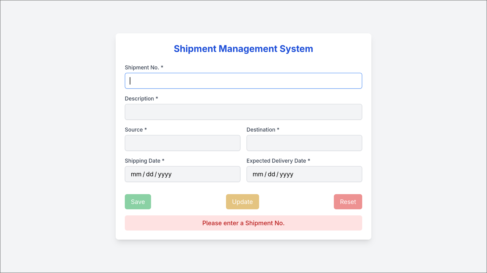

# Shipment Management System

## Table of Contents
- [Description](#description)
- [Benefits of using JsonPowerDB](#benefits-of-using-jsonpowerdb)
- [Scope of Functionalities](#scope-of-functionalities)
- [Illustrations](#illustrations)
- [Examples of Use](#examples-of-use)
- [Project Status](#project-status)
- [Release History](#release-history)
- [Sources](#sources)
- [Other Information](#other-information)

---

## Description
The Shipment Management System is a simple web application built with HTML, TailwindCSS, and JavaScript.  
It uses JsonPowerDB (JPDB) as the backend to manage shipment records.  
The system allows users to add, update, validate, and reset shipment details easily.

---

## Benefits of using JsonPowerDB
- Schema-free and developer-friendly  
- Real-time performance with in-memory database  
- Easy to use REST APIs for CRUD operations  
- Lightweight and scalable  
- Secure token-based authentication  
- Minimal setup required  

---

## Scope of Functionalities
- Add new shipment records  
- Fetch existing shipment details by Shipment No.  
- Update shipment records  
- Validate expected delivery date against shipping date  
- Reset form with one click  
- Show success and error messages  

---

## Illustrations
Application Screenshot:  

---

## Examples of Use
1. Enter a new Shipment No. → Fill in details → Save  
2. Enter an existing Shipment No. → View and edit details → Update  
3. Use Reset button to clear the form  

---

## Project Status
- Current Version: v1.0.0  
- Features completed: Add, Update, Reset, Validation, Database integration  
- Future improvements may include search, filtering, reporting, and authentication  

---

## Release History
- v1.0.0 – Initial release with CRUD support using JsonPowerDB  

---

## Sources
- JsonPowerDB Documentation: http://login2explore.com/jpdb/docs.html  
- TailwindCSS Documentation: https://tailwindcss.com/docs  

---

## Other Information
This project is mainly for learning purposes and demonstrates the integration of JsonPowerDB with a frontend application.  
It can be expanded into a larger logistics or shipment tracking system.
